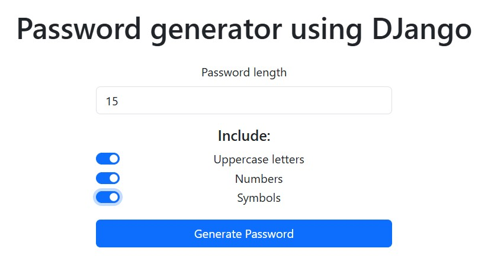
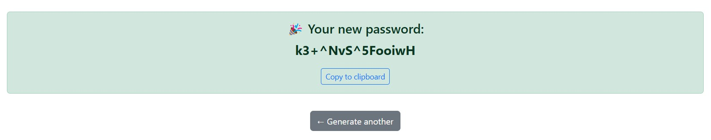

# 🔐 Password Generator con Django

Este es un generador de contraseñas construido con **Python** y **Django**, que permite a los usuarios crear contraseñas seguras de forma sencilla desde una interfaz web.

## ✨ Características

- Interfaz amigable con **Bootstrap 5**.
- Personalización de la contraseña:
  - Longitud configurable.
  - Inclusión de mayúsculas, números y símbolos.
- Botón para copiar la contraseña generada al portapapeles.

## 🛠️ Instalación y ejecución local

1. **Clona el repositorio**:
    ```bash
   git clone https://github.com/EstebanKuh/password_generator.git
   cd password_generator
   ```

2. **Instala dependencias**:
    ```bash
    pip install django
    ```

3.  **Ejecuta el servidor de desarrollo**:
    ```bash
    python manage.py runserver
    ```

4. **Abre tu navegador**:
    Visita ```http://127.0.0.1:8000```

## 🧠 Estructura del proyecto

La estructura del proyecto es la siguiente:
```
password_generator/
├── manage.py
├── djangoproject/                  # Directorio del proyecto Django
│   ├── __init__.py
│   ├── settings.py                 # Configuración del proyecto Django
│   ├── urls.py                     # Rutas del proyecto
│   ├── asgi.py
│   └── wsgi.py
└── passgen/                         # Aplicación Django para el generador de contraseñas
    ├── __init__.py
    ├── admin.py
    ├── apps.py
    ├── migrations/
    ├── models.py
    ├── tests.py
    ├── views.py                    # Lógica de las vistas
    ├── templates/
    │   ├── home.html               # Plantilla de la página principal
    └── └── password.html           # Plantilla para mostrar la contraseña generada

```

### Descripción de los principales archivos y directorios:

- **`manage.py`**: El script principal para interactuar con el proyecto Django, como ejecutar el servidor de desarrollo, realizar migraciones, etc.
- **`djangoproject/`**: Este es el directorio principal del proyecto donde se almacenan las configuraciones y archivos centrales de Django.
  - **`settings.py`**: Contiene todas las configuraciones del proyecto Django, como bases de datos, aplicaciones instaladas, middleware, etc.
  - **`urls.py`**: El archivo donde se configuran las rutas de URL para el proyecto.
  - **`wsgi.py` y `asgi.py`**: Configuraciones para la implementación en servidores WSGI y ASGI (para ejecutar el proyecto en producción).
- **`passgen/`**: Esta es la aplicación Django específica que contiene la lógica para el generador de contraseñas.
  - **`views.py`**: Define las vistas de la aplicación, que en este caso son las funciones que generan la contraseña y muestran la página de inicio.
  - **`templates/`**: Contiene los archivos HTML que definen la interfaz de usuario. En este caso, `home.html` y `password.html` son las vistas principales.


## 📷 Capturas de pantalla
<figure align="center">
    
    <figcaption>Home page.</figcaption>
</figure>
<figure align="center">
    
    <figcaption>New password page.</figcaption>
</figure>

## 📌 Posibles mejoras
- Permitir guardar contraseñas en una base de datos (opcional).
- Agregar validación para asegurar cierto nivel de seguridad.
- Cambiar a un sistema de POST en lugar de GET para mejorar la privacidad.

## 📄 Licencia
Este proyecto está bajo la licencia [MIT](https://opensource.org/licenses/MIT).

Copyright (c) [2025] [Esteban Kuh]
